# Circuit-Breaker
##목차   
###
* [Step00] 참조문서
* [Step10] circuit breaker 란?
* [Step20] Why resilience4j?
* [Step30] dependency를 설정하기
* [Step40] circuit breaker 설정해보기
* [Step50] circuitBreaker 확인해보기
* [step60] circuitbreaker의 옵션 살펴보기
* [step70] 부가적인 UI 설정 (acturator, prometheus, grafana)


### [Step00] 참조문서
> 공식   
https://resilience4j.readme.io/docs   
> 
> 공식 예제 git   
> https://github.com/resilience4j/resilience4j-spring-boot2-demo
>
> blog   
> https://happycloud-lee.tistory.com/219

### [Step10] circuit breaker 란?
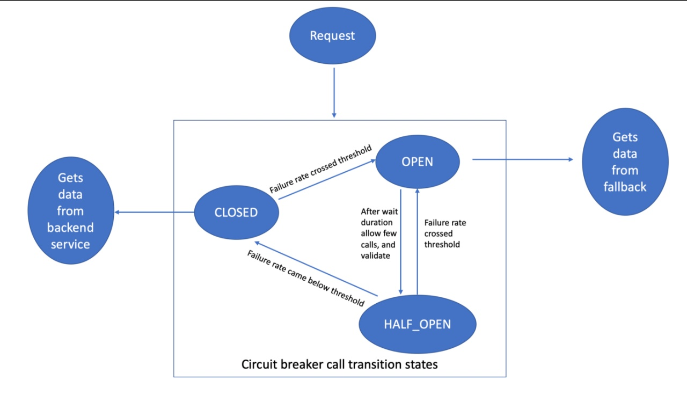

>회로차단기 형태로 장애가 전파되는 현상을 막는 기능을 한다.   
> 
> 핵심모듈   
> * CircuitBreaker  4순위
> * Bulkhead (Thread별 설정) 1순위
> * RateLimiter (시간 당 실행횟수) 3순위 
> * Retry (재시도 횟수) 5순위
> * TimeLimiter (시간제어) 2순위
> 
> 핵심모듈 적용 순서
> Retry ( CircuitBreaker ( RateLimiter ( TimeLimiter ( Bulkhead ( Function ) ) ) ) )

### [Step20] Why resilience4j?
>https://resilience4j.readme.io/docs/comparison-to-netflix-hystrix   
> 
>넷플릭스의 hystrix에서 발전하여 만들어졌다고 한다. hystirx은 공식적으로 지원을 중단한다고 밝혀
resilience4j를 선택하게 되었다.

### [Step30] dependency를 설정하기
> build.gradle 참조
> 

### [Step40] circuit breaker 설정해보기
> 1.package create   
> >controller, service   
> 
> 2.service package 에 Service.java interface 생성

```java
package com.example.springcircuitbreaker.service;

public interface Service {

    String failure();

    String success();

}
```

> 3.service package 에 BackendASerivce.java class 생성

```java
package com.example.springcircuitbreaker.service;

import io.github.resilience4j.circuitbreaker.annotation.CircuitBreaker;
import org.springframework.http.HttpStatus;
import org.springframework.stereotype.Component;
import org.springframework.web.client.HttpServerErrorException;

@Component(value = "backendAService")
public class BackendASerivce implements Service{

    private static final String BACKEND_A = "backendA";

    @Override
    @CircuitBreaker(name = BACKEND_A)
    public String failure() {
        throw new HttpServerErrorException(HttpStatus.INTERNAL_SERVER_ERROR, "This is a remote exception");
    }

    @Override
    public String success() {
        return "Hello World from backend A";
    }
}
```
> 4.controller package 에 BackendAController.java class 생성
```java
package com.example.springcircuitbreaker.controller;

import com.example.springcircuitbreaker.service.BackendASerivce;
import org.springframework.beans.factory.annotation.Autowired;
import org.springframework.web.bind.annotation.GetMapping;
import org.springframework.web.bind.annotation.RequestMapping;
import org.springframework.web.bind.annotation.RestController;

@RestController
@RequestMapping(value = "/backendA")
public class BackendAController {

    @Autowired
    BackendASerivce businessAService;

    @GetMapping("failure")
    public String failure(){
        return businessAService.failure();
    }

    @GetMapping("success")
    public String success(){
        return businessAService.success();
    }
}
```

>5.서비스 확인해보기
> 
> http://localhost:8282/backendA/failure 요청
> 
> 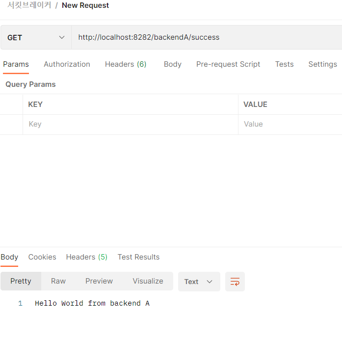
> 
> http://localhost:8282/backendA/success 요청   
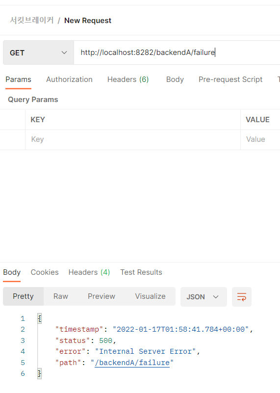
> 
> **6.circuit-breaker 옵션설정**
> 
> 
>7.actuator 확인하기   
> build.gradle 에 actuator 추가 시 자동적으로 /actuator url을 제공해준다.
> > implementation 'org.springframework.boot:spring-boot-starter-actuator'
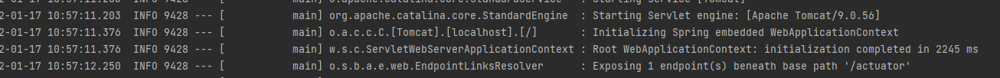
>
> circuit-breaker에 대한 actuator도 제공받으려면 application.properties 에 추가 설정

```
management.endpoints.web.exposure.include=* 
management.endpoint.health.show-details=always
management.health.circuitbreakers.enabled=true

resilience4j.circuitbreaker.configs.default.registerHealthIndicator=true
resilience4j.circuitbreaker.instances.backendA.baseConfig=default
```

> 옵션설명   
> management.endpoints.web.exposure.include=*   
> > actuator 설정으로 부가적인 endPoint에 대한 제공을 받는 설정    
> > keyName들 배열로도 설정 가능 circuitbreakers,circuitbreakers-name   
> 
> resilience4j.circuitbreaker.configs.default.registerHealthIndicator=true   
> > actuator 에 circuitbreakr의 endPoint를 제공하겠다는 설정
> 
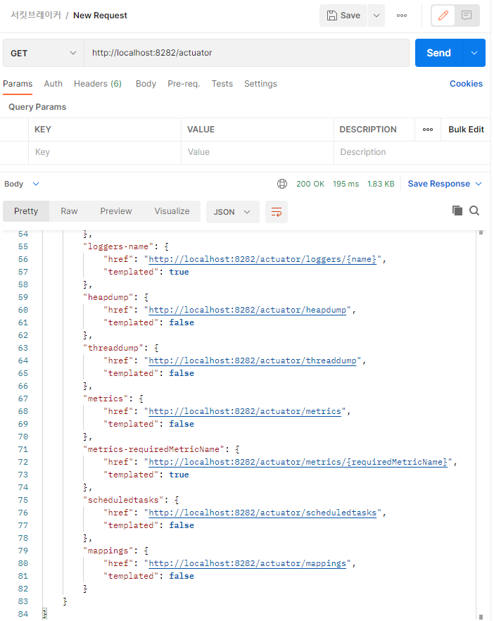

# [Step50] circuitBreaker 확인해보기
http://localhost:8282/actuator/circuitbreakers 로 내가 설정한 circuitbreakers 가 등록되어 있는지 확인 가능

# [step60] circuitbreaker의 옵션 살펴보기

옵션을 설정하는 방법 두가지
>
> * properties 파일 이용
> https://resilience4j.readme.io/docs/getting-started-3
>
>* java source 이용 
> https://resilience4j.readme.io/docs/examples

옵션 공식문서 (메뉴 : CircuitBreaker )   
https://resilience4j.readme.io/docs/circuitbreaker 

기본적인 설정
> slidingWindowType : COUNT_BASED (default 건수), TIME_BASED(시간)   
> slidingWindowSize : 통계건수   
> minimumNumberOfCalls : 최소요청횟수    
> failureRateThreshold : 실패율
> waitDurationInOpenState : Circuit Breaker유지시간   
> recordExceptions : circuit-breaker 에서 모니터링 할 Exception 설정 (설정하지 않으면 모든 Exception)
>  
옵션에 적용해보기

```

resilience4j.circuitbreaker.instances.backendA.slidingWindowSize=10
resilience4j.circuitbreaker.instances.backendA.minimumNumberOfCalls=2
resilience4j.circuitbreaker.instances.backendA.failureRateThreshold=60
resilience4j.circuitbreaker.instances.backendA.waitDurationInOpenState=10000

# if recordExceptions is not setted all Exception
#resilience4j.circuitbreaker.instances.backendA.recordExceptions[0]=org.springframework.web.client.HttpServerErrorException
#resilience4j.circuitbreaker.instances.backendA.recordExceptions[1]=java.io.IOException

```

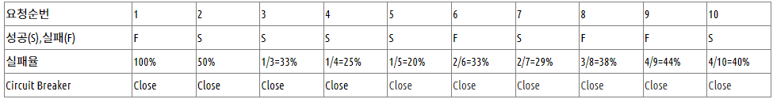

위의 옵션설정대로라면 2회 이후에 최근 10건의 요청중 실패율이 60% 이상이면 Circuit Breaker가 오픈된다.

# [Step70] 테스트코드 작성을 통한 해당 옵션 확인해보기

SpringCircuitbreakerApplicationTests.java 
```java
package com.example.springcircuitbreaker;

import io.github.resilience4j.circuitbreaker.CircuitBreaker;
import io.github.resilience4j.circuitbreaker.CircuitBreakerRegistry;
import org.junit.jupiter.api.BeforeEach;
import org.junit.jupiter.api.extension.ExtendWith;
import org.springframework.beans.factory.annotation.Autowired;
import org.springframework.boot.test.autoconfigure.web.reactive.AutoConfigureWebTestClient;
import org.springframework.boot.test.context.SpringBootTest;
import org.springframework.boot.test.web.client.TestRestTemplate;
import org.springframework.test.context.junit.jupiter.SpringExtension;

@ExtendWith(SpringExtension.class)
@AutoConfigureWebTestClient
@SpringBootTest(webEnvironment = SpringBootTest.WebEnvironment.RANDOM_PORT,
		classes = SpringCircuitbreakerApplication.class)
abstract class SpringCircuitbreakerApplicationTests {

	protected static final String BACKEND_A = "backendA";

	@Autowired
	protected CircuitBreakerRegistry circuitBreakerRegistry;

	@Autowired
	protected TestRestTemplate restTemplate;

	@BeforeEach
	public void setup() {
		// 초기 실행 시 circuit-breaker를 close 상태로 만든다.
		transitionToClosedState(BACKEND_A);
	}

	protected void transitionToOpenState(String circuitBreakerName) {
		CircuitBreaker circuitBreaker = circuitBreakerRegistry.circuitBreaker(circuitBreakerName);
		circuitBreaker.transitionToOpenState();
	}

	protected void transitionToClosedState(String circuitBreakerName) {
		CircuitBreaker circuitBreaker = circuitBreakerRegistry.circuitBreaker(circuitBreakerName);
		circuitBreaker.transitionToClosedState();
	}
}
```

AbstractCircuitBreakerTest.java

```java
package com.example.springcircuitbreaker;

import io.github.resilience4j.circuitbreaker.CircuitBreaker;

import static org.assertj.core.api.Assertions.assertThat;

public abstract class AbstractCircuitBreakerTest extends SpringCircuitbreakerApplicationTests{

    protected void checkHealthStatus(String circuitBreakerName, CircuitBreaker.State state) {
        CircuitBreaker circuitBreaker = circuitBreakerRegistry.circuitBreaker(circuitBreakerName);
        assertThat(circuitBreaker.getState()).isEqualTo(state);
    }
}
```

CircuitBreakerTest.java

```java
package com.example.springcircuitbreaker;

import io.github.resilience4j.circuitbreaker.CircuitBreaker;
import io.vavr.collection.Stream;
import lombok.extern.slf4j.Slf4j;
import org.junit.jupiter.api.Test;
import org.springframework.http.HttpStatus;
import org.springframework.http.ResponseEntity;

import static org.assertj.core.api.Assertions.assertThat;

@Slf4j
public class CircuitBreakerTest extends AbstractCircuitBreakerTest{

    @Test
    public void shouldOpenBackendACircuitBreaker() {

        // 실패, 실패율 : 100%, 수행횟수 : 1번
        produceFailure(BACKEND_A);

        // minimumNumberOfCalls 2로 설정되어 있어 최소 2번은 수행해야 통계를 작성하므로 실패율이 100%이더라도 circuit-breaker 가 오픈되지 않음.
        checkHealthStatus(BACKEND_A, CircuitBreaker.State.CLOSED);

        // 성공, 실패율 : 50%, 수행횟수 : 2번
        produceSuccess(BACKEND_A);

        checkHealthStatus(BACKEND_A, CircuitBreaker.State.CLOSED);

        // 실패, 실패율 : 100 * 2/3 = 66%, 수행횟수 3번
        produceFailure(BACKEND_A);

        checkHealthStatus(BACKEND_A, CircuitBreaker.State.OPEN);
    }

    private void produceFailure(String backend) {
        ResponseEntity<String> response = restTemplate.getForEntity("/" + backend + "/failure", String.class);
        assertThat(response.getStatusCode()).isEqualTo(HttpStatus.INTERNAL_SERVER_ERROR);
    }

    private void produceSuccess(String backend) {
        ResponseEntity<String> response = restTemplate.getForEntity("/" + backend + "/success", String.class);
        assertThat(response.getStatusCode()).isEqualTo(HttpStatus.OK);
    }
}
```
# [Step80] 부가적인 UI 설정

1. /actuator 활용   
circuit breaker가 오픈되었음을 확인
> http://localhost:8282/actuator/health   
> 
> 특정 권한자만 /actuator 접근 허용 설정(EndpointRequest.toAnyEndpoint())    
> https://docs.spring.io/spring-boot/docs/current/reference/html/actuator.html#actuator.endpoints.security

2. prometheus 와 grafana 연동   
> 매번 포스트맨 설정을 통해 확인할 수 없으니 해당 actuator 를 prometheus 와 grafana 연동을 통해 ui 적으로 확인 가능
> 
> build.gradle 추가
> > implementation 'io.micrometer:micrometer-registry-prometheus'
> 
> docker 구성  
> > docker-compose -f docker-compose-desktop.yml up
>
> prometheus 확인   
> > http://localhost:9090/  
> > Status > Targets 메뉴 에서 app과 actuator status가 up인지 확인
> > 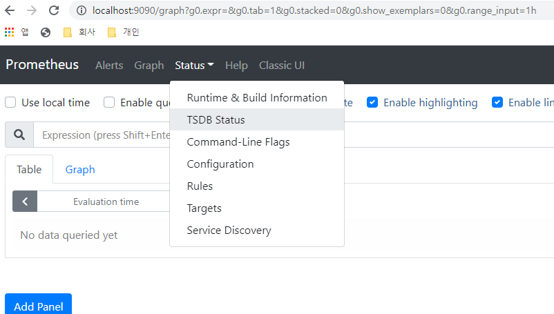
> > 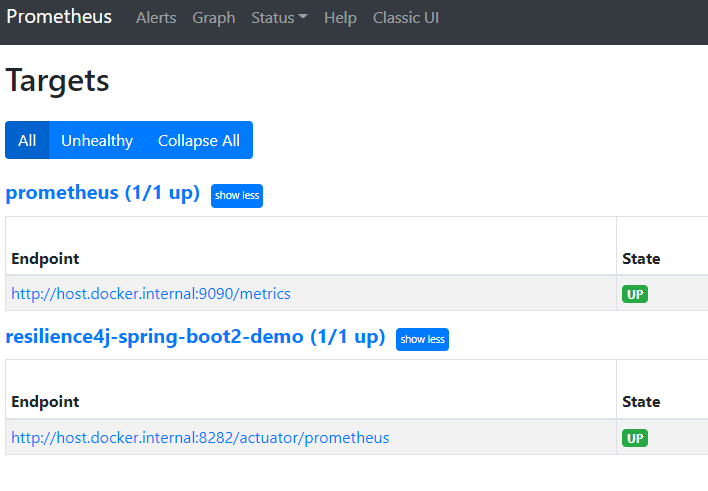
> 
> 
> grafana 확인   
> > http://localhost:3000/   
> > id :admin , password : admin
> >
> >
> > '+' 메뉴에 import 클릭 후 upload json에 ./docker/dashboard.json 추가
> > 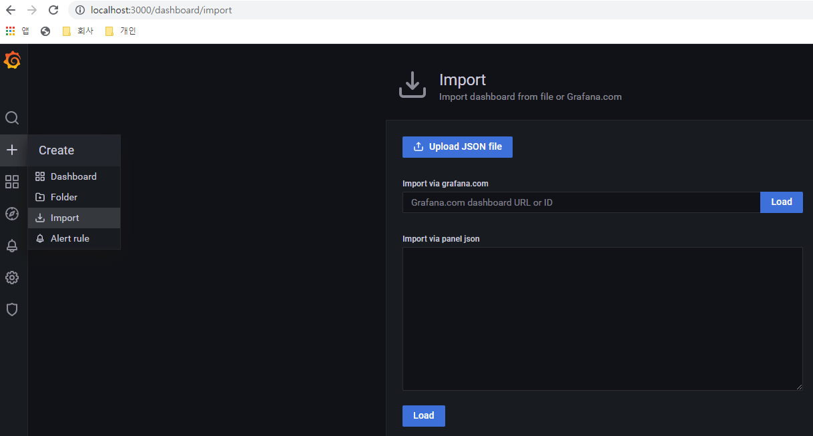   
> 
> > 톱니바퀴 메뉴에 Datasource 클릭 후 Add data source 버튼 클릭 > Prometheus 추가   
> > url :: http://본인 아이피 :9090 입력 (예 : http://192.168.0.28:9090 )
> >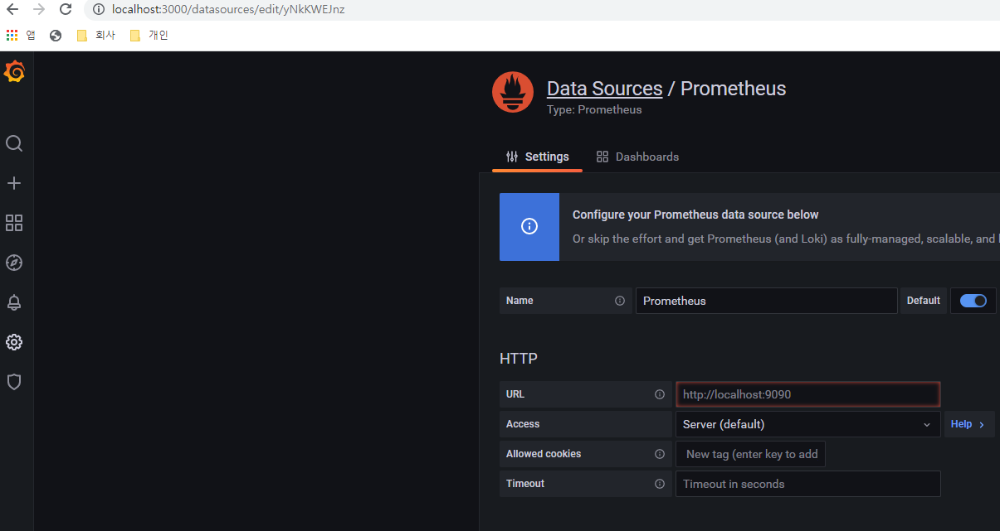
> >
> > ui 확인
> 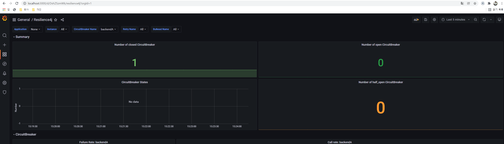


